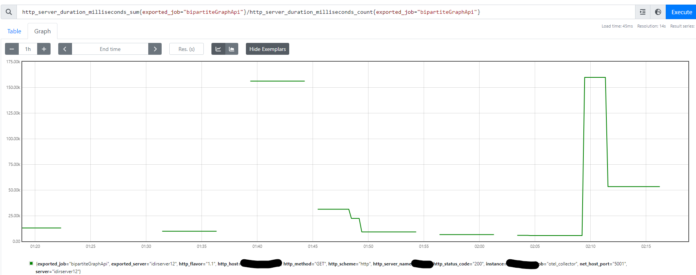
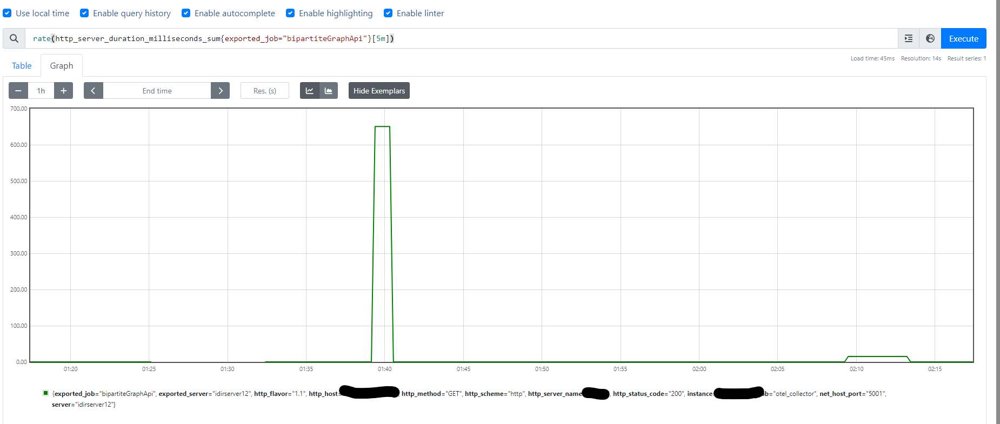
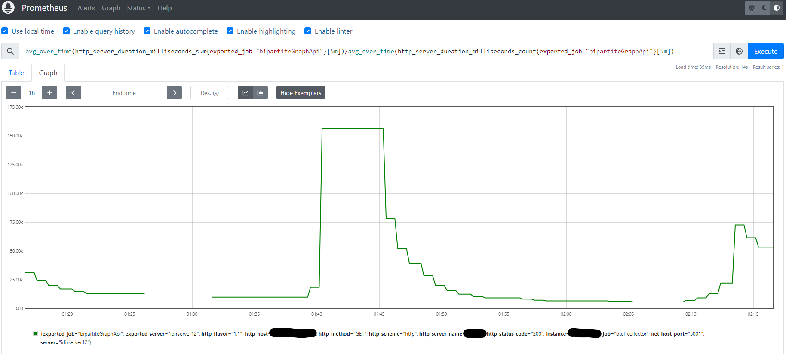
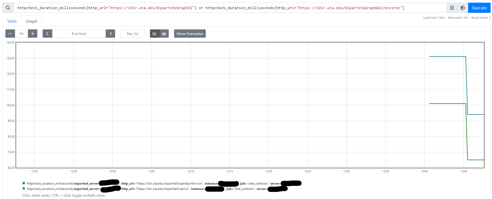
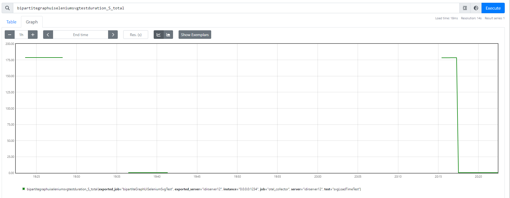

### Overview

#### What is this repo?

#### Architecture

#### How do I get started?

### Installation on server

#### Prometheus

##### Purpose

This is the time series database that will store telemetry data for the systems we want to monitor.
Additionally, it can generate alerts based on customized queries for this data.
These alerts will be sent to ZenDuty through an integration to generate an SMS alert as needed.

##### Steps

1. Download prometheus install file from pre-compiled binaries with (may need to update version strings):
```
$ wget https://github.com/prometheus/prometheus/releases/download/v2.49.1/prometheus-2.49.1.linux-amd64.tar.gz
$ mkdir prometheus
$ tar -C prometheus -xvzf prometheus-2.49.1.linux-amd64.tar.gz
```
2. Move the prometheus installation to the desired location with:

```
$mv prometheus/prometheus-2.49.1 <desired location here>
```
3. Create a `prometheus` linux user and group on the system to run the prometheus instance.

4. Create the folder for prometheus to store data with:
```
$sudo mkdir /var/lib/prometheus/data
$sudo chown -R prometheus:prometheus /var/lib/prometheus
```
5. Copy the template for the prometheus service from this repo to `/etc/systemd/system/prometheus.service` with:
```
# From this repo for pwd:
$sudo cp prometheus/prometheus.service.template /etc/systemd/system/prometheus.service
```
6. Fill in the required data in the service file template with `sudo vim /etc/systemd/system/prometheus.service`

7. Copy the template file to the appropriate location with `$cp <path to repo>/prometheus/prometheus.{yml.template, yml}`

8. Fill in the required data in the configuration template with `vim <path to repo>/prometheus/prometheus.yml`

9. Reload the daemon that manages services with: `$ sudo systemctl daemon-reload`

10. Make SELinux changes to filetype of binary so `systemd` can execute it with: `$chcon -t bin_t <path to prometheus install>/prometheus`

11. Start the prometheus service with: `$ sudo systemctl start prometheus`

12. Confirm the prometheus service is working with: `$ sudo systemctl status prometheus`

#### OpenTelemetry Collector

##### Purpose

This is the collector that will gather telemetry information from the systems we want to monitor.
It will push this data to Prometheus.

##### Steps

Also, it will
1. Follow installation instructions for collector [here](https://opentelemetry.io/docs/collector/installation/\#linux). However, be sure to install the `otelcol-contrib` package which includes community additions.
2. Verify installation was successful with :
```
$ service otelcol-contrib status
Redirecting to /bin/systemctl status otelcol-contrib.service
? otelcol.service - OpenTelemetry Collector
     Loaded: loaded (/usr/lib/systemd/system/otelcol-contrib.service; enabled; vendor preset: disabled)
     Active: active (running) since Fri 2024-02-09 15:55:59 CST; 4min 47s ago
   Main PID: 3260254 (otelcol-contrib)
      Tasks: 22 (limit: 154460)
     Memory: 21.0M
     CGroup: /system.slice/otelcol-contrib.service
             ÀÄ3260254 /usr/bin/otelcol-contrig --config=/etc/otelcol/config.yaml

Feb 09 16:00:45 idir-server12 otelcol[3260254]: Descriptor:
Feb 09 16:00:45 idir-server12 otelcol[3260254]:      -> Name: up
Feb 09 16:00:45 idir-server12 otelcol[3260254]:      -> Description: The scraping was successful
Feb 09 16:00:45 idir-server12 otelcol[3260254]:      -> Unit:
Feb 09 16:00:45 idir-server12 otelcol[3260254]:      -> DataType: Gauge
Feb 09 16:00:45 idir-server12 otelcol[3260254]: NumberDataPoints #0
Feb 09 16:00:45 idir-server12 otelcol[3260254]: StartTimestamp: 1970-01-01 00:00:00 +0000 UTC
Feb 09 16:00:45 idir-server12 otelcol[3260254]: Timestamp: 2024-02-09 22:00:45.394 +0000 UTC
Feb 09 16:00:45 idir-server12 otelcol[3260254]: Value: 1.000000
Feb 09 16:00:45 idir-server12 otelcol[3260254]:         {"kind": "exporter", "data_type": "metrics", "name": "debug"}
$
```
3. Clone this repo onto the server.
4. Follow instructions for [Automatic service configuration](https://opentelemetry.io/docs/collector/installation/#automatic-service-configuration) and point to the `config.yaml` file in the `otel` folder of this repo.
The file must be modified with the following command since the `otelcol-contrib` package is used: `vi /etc/otelcol-contrib/otelcol-contrib.conf`
5. Confirm the service is operating as expected with:
```
$ sudo systemctl restart otelcol
$ sudo journalctl -u otelcol
```
#### Selenium

##### Purpose

This is the engine that will open a web-browser and interact with systems being monitored,
the interaction data will be sent to the OpenTelemetry Collector.

##### Steps

1. Download the Google Chrome `zip` package with: `wget https://edgedl.me.gvt1.com/edgedl/chrome/chrome-for-testing/121.0.6167.85/linux64/chrome-linux64.zip`
&amp; unzip the file.
2. Move the Google Chrome folder containing the executable `chrome` binary to the `/usr/lib` folder.
3. Add symbolic link to `/usr/bin` for the `chrome executable` that was just moved.
4. Confirm Google Chrome is installed with:
```
$ chrome
[3865202:3865202:0210/142420.413294:ERROR:ozone_platform_x11.cc(239)] Missing X server or $DISPLAY
[3865202:3865202:0210/142420.413354:ERROR:env.cc(257)] The platform failed to initialize.  Exiting.
```
5. Locate the URL to use for the `chromedriver` that matches the system and chrome version being used from [here](https://googlechromelabs.github.io/chrome-for-testing/last-known-good-versions-with-downloads.json)
6. Download the `chromedriver` with: `wget <url here>`
7. Unzip the file &amp; `cd` to the unzipped folder
8. Move the file and configure it to be on `$PATH` with:
```
$ sudo mv chromedriver /usr/bin/chromedriver
$ sudo chown root:root /usr/bin/chromedriver
$ sudo chmod +x /usr/bin/chromedriver
```
9. Create &amp; activate `virtualenv` to use `python` bindings for Selenium
10. Install Selenium bindings for `python` in `virtualenv` with: `pip install -r selenium/requirements.txt`
11. Download latest `selenium-server.jar` file with `wget` from [here](https://github.com/SeleniumHQ/selenium/releases/tag/selenium-4.17.0),
then move the file where it should be installed.
12. Copy the `selenium/selenium-server.service` file from this repo to `/etc/systemd/system/selenium-server.service`
13. Customize the file as indicated in the file
14. Copy the `selenium/crontab-script.sh.template` file to `selenium/crontab-script.sh`
15. Customize the `selenium/crontab-script.sh` file as needed and use `chmod +x` to make it executable.
16. Register the file with expression `* * * * *` to register the synthetic traffic to occur every minute.

#### Resources

- [Install the Collector](https://opentelemetry.io/docs/collector/installation/)
- [A practical guide to data collection with OpenTelemetry and Prometheus](https://grafana.com/blog/2023/07/20/a-practical-guide-to-data-collection-with-opentelem-and-prometheus/)
- [How to Run Prometheus server as a Service?](https://www.devopsschool.com/blog/how-to-run-prometheus-server-as-a-service/)
- [Python app instrumentation](https://opentelemetry.io/docs/languages/python/getting-started/)
- [Otel prometheus remote writer](https://github.com/open-telemetry/opentelemetry-collector-contrib/blob/main/exporter/prometheusremotewriteexporter/README.md#getting-started)
- [Otel prometheus exporter](https://github.com/open-telemetry/opentelemetry-collector-contrib/blob/main/exporter/prometheusremotewriteexporter/README.md#getting-started)
- [Querying examples](https://prometheus.io/docs/prometheus/latest/querying/examples/)
- [promlabs query examples](https://promlabs.com/promql-cheat-sheet/)
- [Capabilities &amp; ChromeOptions](https://chromedriver.chromium.org/capabilities)
- [How to run headless Chrome with Selenium in Python?](https://stackoverflow.com/a/53657649)
- [Configuring and customising drivers](https://www.selenium.dev/documentation/grid/configuration/toml_options/#configuring-and-customising-drivers)
- [Getting Started](https://www.selenium.dev/documentation/webdriver/getting_started/)


#### Queries

To run the queries, open an ssh tunnel to port-forward prometheus to `localhost:9090`, then visit `http://localhost:9090`
in a browser to view the following queries.

##### `bipartiteGraphApi`


```
http_server_duration_milliseconds_sum{exported_job="bipartiteGraphApi"}/http_server_duration_milliseconds_count{exported_job="bipartiteGraphApi"}
```
Average time for a request over time.
Shows spikes, but slowly decreases based on number of requests.

---


```
rate(http_server_duration_milliseconds_sum{exported_job="bipartiteGraphApi"}[5m])
```
Calculate the 5min averaged rate over a 1hr period of the http server request duration.
Shows spikes in http request duration.
Difficult to increase fast enough to reflect latency buildup of disabling cache.

---


```
avg_over_time(http_server_duration_milliseconds_sum{exported_job="bipartiteGraphApi"}[5m])/avg_over_time(http_server_duration_milliseconds_count{exported_job="bipartiteGraphApi"}[5m])
```
Calculate the average time for an http request to complete within 5m sliding interval windows over time.
Shows average request time and trends.

---


```
httpcheck_duration_milliseconds{http_url="https://idir.uta.edu/bipartiteGraphUi"} or httpcheck_duration_milliseconds{http_url="https://idir.uta.edu/bipartiteGraphApi/environ"}
```
Display http healthcheck duration over time for UI and API components on initial load of webpage.
Does NOT include information for custom queries made with the UI.

---


```
bipartitegraphuiseleniumsvgtestduration_S_total
```
Display synthetic traffic duration over time for UI testing.
Currently the test is simple, the webapp is visited and the
browser driver will wait for the `svg` containing the rendering
of the bipartite graph to appear. Once this is detected
on the webpage the test ends and the duration is sent through
OTEL Collector to Prometheus for graphing and alerting.
